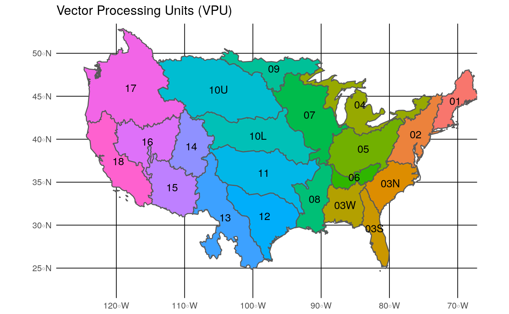

<!-- README.md is generated from README.Rmd. Please edit that file -->
nhdR
====

[](http://www.repostatus.org/#active) [](https://cran.r-project.org/package=nhdR) [](https://cran.r-project.org/package=nhdR) [](https://travis-ci.org/jsta/nhdR) [](https://ci.appveyor.com/project/jsta/nhdR)

The goal of nhdR is to provide R tools for interacting with the National Hydrography Dataset.

Installation
------------

You can install nhdR from github with:

``` r
# install.packages("devtools")
devtools::install_github("jsta/nhdR")
```

Usage
-----

### Load package

``` r
library(nhdR)
#> Loading required package: maps
```

### NHD Plus

Unlike the standard NHD, the NHD-Plus exports are organized by vector processing unit (vpu). See below for a low resolution vpu map (also `nhdR::vpu_shp`). A hi-res version can be found [here](http://www.horizon-systems.com/NHDPlus/NHDPlusV2_data.php).



``` r
# get a vpu export
nhd_plus_get(vpu = 4, "NHDSnapshot")
```

``` r
# list layers
nhd_plus_list(vpu = 4, "NHDSnapshot")
#> [1] "NHDAreaEventFC.shp"  "NHDArea.shp"         "NHDFlowline.shp"    
#> [4] "NHDLineEventFC.shp"  "NHDLine.shp"         "NHDPointEventFC.shp"
#> [7] "NHDPoint.shp"        "NHDWaterbody.shp"
```

``` r
# get layer info
nhd_plus_info(vpu = 4, "NHDSnapshot", "NHDWaterbody")
```

    #>  [1] "Driver: ESRI Shapefile; number of rows: 31830 "     
    #>  [2] "Feature type: wkbPolygon with 3 dimensions"         
    #>  [3] "Extent: (-93.24332 40.43575) - (-73.61814 48.11344)"
    #>  [4] "CRS: +proj=longlat +datum=NAD83 +no_defs  "         
    #>  [5] "LDID: 87 "                                          
    #>  [6] "Number of fields: 12 "                              
    #>  [7] "         name type length typeName"                 
    #>  [8] "1       COMID    0      9  Integer"                 
    #>  [9] "2       FDATE    9     10     Date"                 
    #> [10] "3  RESOLUTION    4      7   String"                 
    #> [11] "4     GNIS_ID    4     10   String"                 
    #> [12] "5   GNIS_NAME    4     65   String"                 
    #> [13] "6    AREASQKM    2     19     Real"                 
    #> [14] "7   ELEVATION    2     19     Real"                 
    #> [15] "8   REACHCODE    4     14   String"                 
    #> [16] "9       FTYPE    4     24   String"                 
    #> [17] "10      FCODE    0      9  Integer"                 
    #> [18] "11 SHAPE_LENG    2     19     Real"                 
    #> [19] "12 SHAPE_AREA    2     19     Real"

``` r
# load layer
dt <- nhd_plus_load(vpu = 4, "NHDSnapshot", "NHDWaterbody")
#> Reading layer `NHDWaterbody' from data source `/home/jose/.local/share/nhdR/NHDPlus/GL_04_NHDSnapshot/NHDWaterbody.shp' using driver `ESRI Shapefile'
#> Simple feature collection with 31830 features and 12 fields
#> geometry type:  POLYGON
#> dimension:      XYZ
#> bbox:           xmin: -93.24332 ymin: 40.43575 xmax: -73.61814 ymax: 48.11344
#> epsg (SRID):    4269
#> proj4string:    +proj=longlat +datum=NAD83 +no_defs
```

### NHD

``` r
nhd_get(state = c("DC", "HI"))
```

``` r
nhd_list(state = "DC")
#>  [1] "ExternalCrosswalk"           "NHDFCode"                   
#>  [3] "NHDFeatureToMetadata"        "NHDFlow"                    
#>  [5] "NHDFlowlineVAA"              "NHDMetadata"                
#>  [7] "NHDProcessingParameters"     "NHDReachCodeMaintenance"    
#>  [9] "NHDReachCrossReference"      "NHDSourceCitation"          
#> [11] "NHDStatus"                   "NHDVerticalRelationship"    
#> [13] "NHDPoint"                    "NHDFlowline"                
#> [15] "NHDLine"                     "NHDArea"                    
#> [17] "NHDWaterbody"                "NHDAreaEventFC"             
#> [19] "NHDLineEventFC"              "NHDPointEventFC"            
#> [21] "WBDLine"                     "NonContributingDrainageArea"
#> [23] "NWISBoundary"                "NWISDrainageArea"           
#> [25] "WBDHU14"                     "WBDHU8"                     
#> [27] "WBDHU2"                      "WBDHU4"                     
#> [29] "WBDHU6"                      "WBDHU10"                    
#> [31] "WBDHU12"                     "WBDHU16"                    
#> [33] "HYDRO_NET_Junctions"        
#> attr(,"driver")
#> [1] "OpenFileGDB"
#> attr(,"nlayers")
#> [1] 33
```

``` r
nhd_info(state = "DC", layer_name = "NHDWaterbody")
#> Source: "/home/jose/.local/share/nhdR/NHDH_DC.gdb", layer: "NHDWaterbody"
#> Driver: OpenFileGDB; number of rows: 8025 
#> Feature type: wkbPolygon with 3 dimensions
#> Extent: (-78.07095 38.52142) - (-76.82219 39.64683)
#> CRS: +proj=longlat +datum=NAD83 +no_defs  
#> Number of fields: 12 
#>                    name type length typeName
#> 1  Permanent_Identifier    4     40   String
#> 2                 FDate   11      0 DateTime
#> 3            Resolution    0      0  Integer
#> 4               GNIS_ID    4     10   String
#> 5             GNIS_Name    4     65   String
#> 6              AreaSqKm    2      0     Real
#> 7             Elevation    2      0     Real
#> 8             ReachCode    4     14   String
#> 9                 FType    0      0  Integer
#> 10                FCode    0      0  Integer
#> 11         Shape_Length    2      0     Real
#> 12           Shape_Area    2      0     Real
```

``` r
head(nhd_load(state = "DC", layer_name = "NHDWaterbody"))
#> Reading layer `NHDWaterbody' from data source `/home/jose/.local/share/nhdR/NHDH_DC.gdb' using driver `OpenFileGDB'
#> Simple feature collection with 8025 features and 12 fields
#> geometry type:  MULTIPOLYGON
#> dimension:      XYZ
#> bbox:           xmin: -78.07095 ymin: 38.52142 xmax: -76.82219 ymax: 39.64683
#> epsg (SRID):    4269
#> proj4string:    +proj=longlat +datum=NAD83 +no_defs
#> Simple feature collection with 6 features and 12 fields
#> geometry type:  MULTIPOLYGON
#> dimension:      XY
#> bbox:           xmin: -77.5767 ymin: 38.68957 xmax: -76.99631 ymax: 39.5882
#> epsg (SRID):    4269
#> proj4string:    +proj=longlat +datum=NAD83 +no_defs
#>   Permanent_Identifier               FDate Resolution GNIS_ID GNIS_Name
#> 1             51772167 2002-09-15 01:00:00          2    <NA>      <NA>
#> 2             46565431 2002-08-22 01:00:00          2    <NA>      <NA>
#> 3             51767181 2002-09-15 01:00:00          2    <NA>      <NA>
#> 4             51767223 2002-09-15 01:00:00          2    <NA>      <NA>
#> 5             51767287 2002-09-15 01:00:00          2    <NA>      <NA>
#> 6             51767709 2002-09-15 01:00:00          2    <NA>      <NA>
#>   AreaSqKm Elevation      ReachCode FType FCode Shape_Length   Shape_Area
#> 1    0.005        NA 02070008004787   436 43624 0.0032275838 5.164066e-07
#> 2    0.000        NA 02070010004605   436 43624 0.0005402029 1.879174e-08
#> 3    0.002        NA 02070008004808   390 39004 0.0017289109 1.954519e-07
#> 4    0.001        NA 02070008004829   390 39004 0.0013369633 1.239613e-07
#> 5    0.001        NA 02070008004860   390 39004 0.0011083831 8.130533e-08
#> 6    0.002        NA 02070008005063   390 39004 0.0016429957 1.745505e-07
#>                            Shape
#> 1 MULTIPOLYGON(((-77.11381732...
#> 2 MULTIPOLYGON(((-76.99631072...
#> 3 MULTIPOLYGON(((-77.56942072...
#> 4 MULTIPOLYGON(((-77.56947212...
#> 5 MULTIPOLYGON(((-77.57644239...
#> 6 MULTIPOLYGON(((-77.46932972...
```
